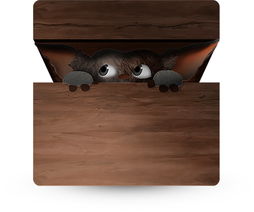

  


#GREMLIN.JS
dead simple web components

GREMLIN.JS is a highly modularized library to build web components. These components are not as fancy as libraries like Polymer, but they're great to build reusable javascript components for boringly normal websites, where your HTML is rendered on the server.  
Throw in some bundled js, add the corresponding tags to your HTML, and you're good to go.

```javascript
import gremlins from 'gremlins';
gremlins.create('my-slider', {
  created: function(){
    this.initSlider();
  }
  // awesome slider magic
});
```

```html
<my-slider>
  <!-- awesome slider HTML -->
</my-slider>
```

## Installation
[Release Notes](https://github.com/grmlin/gremlinjs/blob/master/release-notes.md)

### npm
    
    $ npm install --save gremlins
    
### global

    <script src="gremlin.js" />
    
    

---

*All examples in this documentation use the <a href="https://babeljs.io/docs/learn-es2015/">ES2015/ES6 syntax</a>. Use a compiler like <a href="https://babeljs.io/"> Babel </a>  to compile them into ES5 compatible Javascript.*

## Creating Components

To create a new component, you'll have to add new specs for them to GREMLIN.JS

A Spec is a javascript object literal, that later will be used as a prototype for all the components found and intantiated in the page.

Every component will inherit from `Gremlin`, the base prototype of all components.

-----

### Gremlin

#### mixins
An object, or an array of objects, used as mixin(s). This way it's easy to extend you're components capabilities in a modular way.  
If you're mixins and componenet use the same method names, they will be decorated and called in the order they were added to the spec.

#### el
The dom element for this component. Available inside the `initialize` call

#### created()
called, when the element was created. Best understood as a constructor function that's only called once.  
This happens if it's an element already existing in the HTML or after using `document.createElement()`

#### attached()
called, when the element was added to the dom

#### detached()
called, when the element was removed from the dom

#### create()
extends the base prototype with a new spec. **Don't overwrite this**, you can't extend from your **new** component anymore if you do so.   
This is the method `gremlins.create` calls!

----

### gremlins.create(tagName, Spec)

Create a new spec for components

```js
gremlins.create('foo-bar', {
  created: function(){
  	// your constructor function called in the context of every dom element found for this spec
  	this.hello();
  },
  hello: function(){
    this.el.querySelector('span').innerHTML = 'hello world!';
  }
});
```

### Using Components

```html
<foo-bar>
	<span></span>
</foo-bar>
```

will be rendered with javascript as

```html
<foo-bar>
	<span>hello world!</span>
</foo-bar>
```


**GREMLIN.JS**, a dependency-free library to build reusable Javascript components.


[**Visit Website**](http://grml.in)


